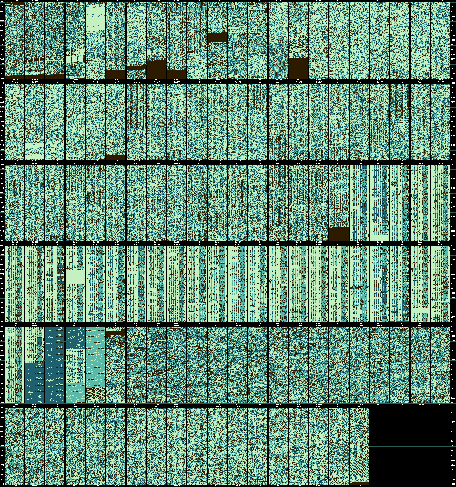

# Disassembly of Hamtaro: Ham-Hams Unite!

This project aims to create human-readable code that can be assembled into a ROM that exactly matches the US release of "Hamtaro: Ham-Hams Unite!" for the Game Boy Color. Reverse engineering raw bytes into sensible assembly syntax and data structs is called a disassembly (as opposed to a decompilation).

## Tooling

### BadBoy

The most crucial tool used in this project is the **BadBoy disassembler** created by Daid. It takes an input ROM and an instrumentation file ([playthrough.data](https://github.com/HaychDeeHD/HamHamsUniteDisassembly/blob/main/playthrough.data) in this project) and automatically parses much of the ROM. It is also extensible with custom plugins to parse game-specific structs and scripts, which this project leans on heavily.

For information about BadBoy beyond this project's own docs, check out [the BadBoy discord channel](https://discord.gg/BmQQRpYEYH) and [BadBoy's github repo](https://github.com/daid/BadBoy). During this project I used [my fork of BadBoy](https://github.com/HaychDeeHD/BadBoy/tree/master). At time of writing it only has one difference compared to the official one, but that could change in the future.

* [Edit Makefile to remove unbanked wram flag for rgblink](https://github.com/HaychDeeHD/BadBoy/commit/6ff440e3d95bef85e7f71536e34f40c4c0d89295)

### RGBDS

This lets you write and build Game Boy ROMs. https://rgbds.gbdev.io/

VS Code users may be interested in [this RGBDS extension](https://marketplace.visualstudio.com/items?itemName=donaldhays.rgbds-z80).

### Python 3.12

I used Python 3.12.3 to run the BadBoy disassembler. I have not tested other versions.

## How to run

**You must provide your own ROM file for the US release of  "Hamtaro: Ham-Hams Unite!".** The update script assumes it is located in the root of this repo and named "Hamtaro.gbc".

To get the same disassembly otuput that I have, run the [update.sh](https://github.com/HaychDeeHD/HamHamsUniteDisassembly/blob/main/update.sh) script. It assumes this repo is a sibling of BadBoy. (To exactly match my results you should use [my fork of BadBoy](https://github.com/HaychDeeHD/BadBoy/tree/master).) It will rerun the disassembler, build the resulting assembly files into a GBC ROM, then compare that ROM's hash against the input ROM to verify they match. 

To progress the disassembly you can make changes by adding labels, special BadBoy annotation comments, or plugin edits before running [update.sh](https://github.com/HaychDeeHD/HamHamsUniteDisassembly/blob/main/update.sh). 

## Docs

To learn more about how this game works, please see the docs folder for writeups of what I've come to understand so far.

## Progress

The biggest milsetone I reached is that banks 1C to 3C are "fully disassembled". These banks contain script and text data, which was my primary focus. The raw bytes have all been identified as the appropriate script instructions, but work has not been done to identify what each of those scripts actually do. Several instructions have known lengths for the sake of decoding, but not understood functionality.
